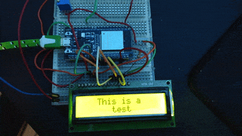

# ESP-IDF HD44780

<H2>ESP-32 drivers for common Hitachi HD44780 character LCD displays.</H2>
Can be dropped into any ESP-IDF project as an IDF components.  Currently supports two row HD44780 based displays.

&nbsp; 

Supports all standard HD44780 display functionality:
 - Initializing displays in either 4-bit or 8-bit mode.
 - Arbitrarily setting the position of the cursor.
 - Controlling whether the cursor is on and whether it blinks.
 - Writing strings of text to the display.
 - Clearing the display.
 - Creating and displaying up to eight arbitrarily defined, custom 5x8 pixel characters.

Written in pure C.

Licensed under the permissive MIT License, these drivers can be copied, used, modified, and distributed openly.
Attribution is appreciated, but is in no way mandatory.

---

<p align="center">
    
</p>

Usage of this library is incredibly simple.  First you have to pick your mode of operation.

HD44780 displays are driven in one of three modes:
 - **8-bit mode:** This is the standard way that these displays have been driven for decades.  All 8 bits of the
   bus are utilized for communications with the LCD driver.  This has numerous obvious disadvantages, most
   especially that no less then 10 (and sometimes 11) GPIOs are required to drive a simple display.  Regardless,
   if you want to drive a display in 8-bit mode for some (presumably legacy) reason, this library fully 
   supports that use case, we've got you covered.
 - **4-bit mode:** This is one of the two 'modern' ways of driving this type of display.  4-bit mode is supported
   by the HD44780 LCD controller locally (with no external circuitry), and can achieve all of the features that 
   8-bit mode can achieve with almost half the pins (usually 6 pins).  The only requirement is that the MCU 
   driving the display is "fast", when compared to the HD44780 controller design from the 80s, an easy
   bar to hurdle.
 - **I2C mode:** This is a ***relatively*** new method of controlling these displays, and it is the most common method
   of display control that you'll see in modern drivers.  This method relies on an external I2C driver, which is
   typically shipped  with character LCDs of this variety in the modern day.  Most HD44780 drivers you see around
   GitHub today are for displays of this variety.  Advantages of this mode are obvious, you only need two pins 
   (SCL and SDA) to support any number of displays/I2C devices.  And, with any modern type of MCU, you can drive
   the I2C bus faster then you could in 8-bit mode parallel operation in the 90s.  I am not currently actively 
   supporting I2C display control, since I mostly wrote this in preparation for a different project (in which I was 
   using an HD44780 in 4-bit mode), and since I don't actually have any of these new displays to test with.  If this 
   erks you and you would like to use this library with an I2C character LCD, please drop an issue on this repo and 
   I'll look into adding support for such a thing.

Once you've determined the display mode you want, you need to make a struct specific to that mode to initialize the 
display.  For 4-bit mode create an HD44780_FOUR_BIT_BUS or, for 8-bit mode, create an HD44780_EIGHT_BIT_BUS struct.  
The structs are as follows:
* 4-bit mode: HD44870_FOUR_BIT_BUS which has six parameters
  * 1: GPIO pin number connected to D4
  * 2: GPIO pin number connected to D5
  * 3: GPIO pin number connected to D6
  * 4: GPIO pin number connected to D7
  * 5: GPIO pin number connected to RS
  * 6: GPIO pin number connected to E
* Example: 
```
HD44780_FOUR_BIT_BUS fourBitBus = { 18, 19, 21, 22, 16, 17 }; 
```

* 8-bit mode: HD44870_EIGHT_BIT_BUS which has ten parameters
  * 1: GPIO pin number connected to D0
  * 2: GPIO pin number connected to D1
  * 3: GPIO pin number connected to D2
  * 4: GPIO pin number connected to D3
  * 5: GPIO pin number connected to D4
  * 6: GPIO pin number connected to D5
  * 7: GPIO pin number connected to D6
  * 8: GPIO pin number connected to D7
  * 9: GPIO pin number connected to RS
  * 10: GPIO pin number connected to E
* Example: 
```
HD44780_EIGHT_BIT_BUS eightBitBus = { 18, 19, 21, 22, 23, 25, 26, 27, 16, 17 }; 
```

Once you've made the struct that corresponds to your desired mode of operation, call either HD44780_initFourBitBus or
HD44780_initEightBitBus, passing in a reference to the struct for either function.
```
HD44780_initFourBitBus(&fourBitBus);
```
```
HD44780_initEightBitBus(&eightBitBus);
```

This function will initialize all of the GPIOs in the struct as outputs, and will perform an initialization
routine on the HD44780 controlled character LCD.

After initializing the bus and the display, the display can be used for normal operation.  This library exposes
a number of functions to the calling application.  All functions as well as their parameters are described below.

---

<details>
<summary><b>HD44780_initFourBitBus(HD44780_FOUR_BIT_BUS *bus)</b></summary>
<h4>Description</h4>
Initializes all GPIOs in the param four bit bus and initializes the display.
<h4>Parameters</h4>
*bus: pointer to the HD44780_FOUR_BIT_BUS struct defining the bus
</details>

---

<details>
<summary><b>HD44780_initEightBitBus(HD44780_EIGHT_BIT_BUS *bus)</b></summary>
<h4>Description</h4>
Initializes all GPIOs in the param eight bit bus and initializes the display.
<h4>Parameters</h4>
*bus: pointer to the HD44780_EIGHT_BIT_BUS struct defining the bus
</details>

---

<details>
<summary><b>HD44780_print(char* data)</b></summary>
<h4>Description</h4>
Prints the param String to the display
<h4>Parameters</h4>
data: character array to print to the display
</details>

---

<details>
<summary><b>HD44780_clear()</b></summary>
<h4>Description</h4>
Clears the display, replacing all characters with white space
</details>

---

<details>
<summary><b>HD44780_setCursorPos(int col, int row)</b></summary>
<h4>Description</h4>
Sets the cursor position to the location specified by the params
<h4>Parameters</h4>
col: Integer column to set the cursor to (0-15)

row: Integer row to set the cursor to (0-1)
</details>

---

<details>
<summary><b>HD44780_homeCursor()</b></summary>
<h4>Description</h4>
Sets the cursor position to the home position of 0, 0
</details>

---

<details>
<summary><b>HD44780_createChar(int slot, uint8_t* data)</b></summary>
<h4>DescrViption</h4>
Create a custom character in the param slot, from the param byte array
<h4>Parameters</h4>
slot: Integer (0-7) of the slot to store the character in

data: Byte array of the character.  
</details>

---

<details>
<summary><b>HD44780_writeChar(int slot)</b></summary>
<h4>Description</h4>
Write a custom character to the display.
<h4>Parameters</h4>
slot: Integer (0-7) of the slot that the custom character was written to.
</details>

---

<details>
<summary><b>HD44780_shiftDispLeft()</b></summary>
<h4>Description</h4>
Shifts all characters on the display one position to the left.
</details>

---

<details>
<summary><b>HD44780_shiftDispRight()</b></summary>
<h4>Description</h4>
Shifts all characters on the display one position to the right.
</details>

---

<details>
<summary><b>HD44780_blink()</b></summary>
<h4>Description</h4>
Turns on the visual cursor and sets it to blink.
</details>

---

<details>
<summary><b>HD44780_noBlink()</b></summary>
<h4>Description</h4>
Turns on the visual cursor and sets it to not blink (remain solid).

<b>NOTE:</b> This is functionally the same as HD44780_cursor()
</details>

---

<details>
<summary><b>HD44780_cursor()</b></summary>
<h4>Description</h4>
Turns on the visual cursor and sets it to not blink (remain solid).

<b>NOTE:</b> This is functionally the same as HD44780_noBlink()
</details>

---

<details>
<summary><b>HD44780_noCursor()</b></summary>
<h4>Description</h4>
Turns off the visual cursor.

<b>NOTE:</b> This is functionally the same as HD44780_dispOn()
</details>

---

<details>
<summary><b>HD44780_dispOff()</b></summary>
<h4>Description</h4>
Turns the display off.

<b>NOTE:</b> As this library does not control the backlight, it is expected
      that toggling the backlight on/off is handled by the main application.
</details>

---

<details>
<summary><b>HD44780_dispOn()</b></summary>
<h4>Description</h4>
Turns the display on and turns off the visual cursor.

<b>NOTE:</b> This is functionally the same as HD44780_noCursor()
</details>

---
