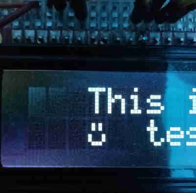

## Custom Character Usage:
The HD44780 supports up to 8 custom 5x8 pixel characters that are stored in the controller's
CGRAM and can be used just like any other predefined character.  To create a character
with this library you use the HD44780_createChar() function, that takes in an integer
parameter of what 'slot' of CGRAM the character should be stored in (basically an
integer identifier for the character), and an array of 8 bytes (uint8_t).  Within
the array, for each byte the last five bits are used to define the pixels of one row of
the character.  The first byte in the array correlates with the top row of the character,
and the 8th byte in the array correlates with the bottom row of the character.

So, the following array:
```
uint8_t smileyChar[8] = {
    0b00000,
    0b01010,
    0b01010,
    0b00000,
    0b10001,
    0b10001,
    0b01110,
    0b00000
};
```
Would create the following smiley face character.

<p align="center">
    
</p>

[Here is a WYSIWYG editor](https://omerk.github.io/lcdchargen/) for generating custom characters
that spits out the appropriate array.  It was written primarily for the Arduino LiquidCrystal
library, but since this library supports this feature in a similar manner to LiquidCrystal, the
output will work the same.

## HD44780 Initialization:
Initializing the HD44780 controller is a little tricky, as the datasheet is somewhat
obtuse about the process and there are two modes that the controller
can be initialized to (4-bit and 8-bit mode).  Outside of the 
[HD44780 datasheet](resources/HD44780.pdf) 
(pdf warning) I got the information to initialize the display from an [Alfred State
College blog](https://web.alfredstate.edu/faculty/weimandn/lcd/lcd_initialization/lcd_initialization_index.html).

HD44780 init steps for either 8 or 4 bit mode are as follows:
1. Wait 100ms (actual startup delay is >40ms, but this is only 
   done once so erring on the side of caution.)
2. Send HD44780_INIT_SEQ (0x30), then delay >4ms.  This is a special
   case of the function set instruction where only the upper nibble
   (D4-D7) is considered by the driver.  Three of these instructions 
   together will cause the driver to reset, which is the goal here.
3. Send HD44780_INIT_SEQ (0x30) again, then delay >100us.
4. Send HD44780_INIT_SEQ (0x30) a third time, then delay >100us.
   This will cause the display to do a soft reset.
5. For 4-bit mode initialization, send instruction HD44780_FOUR_BIT_MODE
   (0x20) and delay >100us.  This tells the controller that all
   commands going forward are on D4-D7 only, and to ignore D0-3 entirely.
   This step should be skipped for 8-bit mode operation.
6. Send the actual function set instruction then wait >50us.  
   The function set instruction is as follows: 
     0b001(DL)(N)(F)00 where:
     - DL is 1 for 8-bit mode or 0 for 4-bit mode
     - N is 0 for one line, or 1 for two line (this is the logical
       number of lines as perceived by the LCD controller, which 
       would still be two for four line displays).
     - F is 0 for 5x8 dot character font, or 1 for 5x10 dot character
       font (this will almost always be 0, or 5x8 font).
     - For 8-bit operation, this will usually be 0x38.  For 4-bit operation, this will 
       usually be 0x28.  In practice, we OR together the DL, N, and F bitmasks here.
7. Send HD44780_DISP_OFF and delay >50us.  The lower three bits 
   of this instruction control whether the display itself (D), 
   the cursor (C), and the cursor blink (B) should be on or off, 
   but for now we turn all of them off.
8. Send HD44780_DISP_CLEAR and delay >3ms.  This clears all 80 DDRAM
   addresses on the display, hence the longer wait time.
9. Send HD44780_ENTRY_MODE and delay >50us.  The lower two bits of 
   this command control whether the cursor should move (I/D) left 
   to right (1) or right to left (0), and whether the display should 
   shift (S) (1) or not shift (0).  We typically want the cursor to 
   move left to right and for the display to not shift, so 0x06.
10. The display is now initialized, but it was turned off in step 7,
    so we have to turn it on and set our display mode.
11. Send HD44780_DISP_ON and delay >50us. Set the lower two bits 
    based on whether the cursor should be on (C) and the cursor 
    should blink (B). For example, sending HD44780_DISP_ON would 
    just turn the display on, HD44780_CUSOR_ON would turn the 
    display on and display the cursor, and HD44780_CURSOR_BLINK would
    turn the cursor on and cause it to blink.

